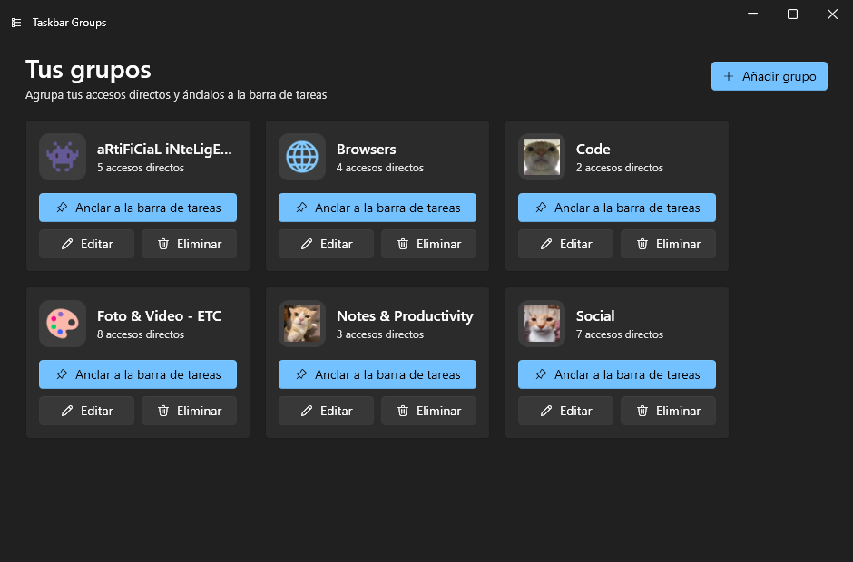
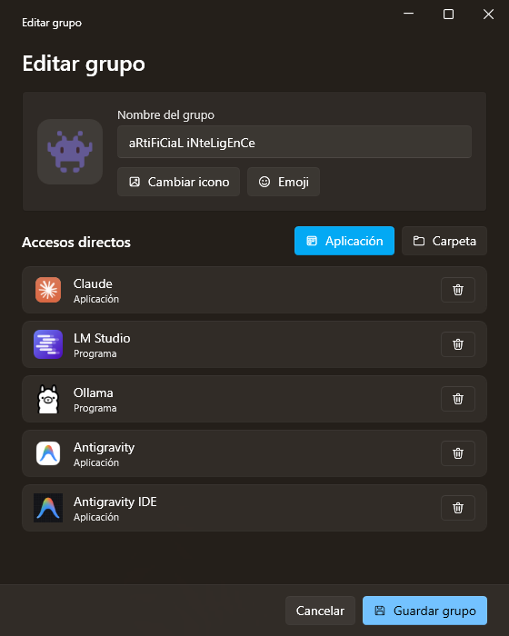
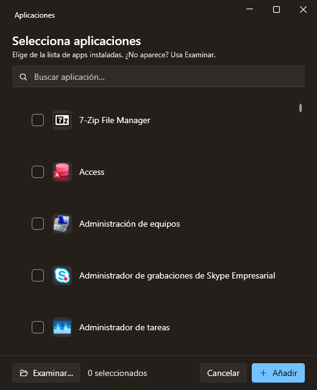
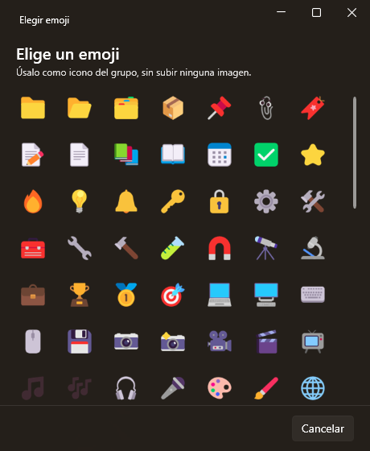
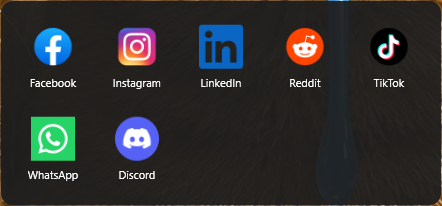

<div align="center">

# 📌 Taskbar Groups — Fluent

**Agrupa tus accesos directos en un solo icono de la barra de tareas.** Una reescritura moderna en **WPF / .NET 8** de Taskbar Groups, con interfaz Fluent (estilo WinUI 3).

🌍 Español · [English](README.md)

<p>
  <a href="https://github.com/Mun1to/TaskbarGroupsFluent/releases/latest">
    
  </a>
  <a href="LICENSE">
    
  </a>
  
</p>

<p align="center">
  <a href="https://github.com/Mun1to/TaskbarGroupsFluent/releases/latest/download/TaskbarGroupsFluent-Setup.exe">
    
  </a>
</p>



</div>

---

## ✨ Qué hace

Taskbar Groups convierte una carpeta llena de apps en **un solo botón de la barra de tareas**. Al pulsarlo se abre un pequeño popup con todas las apps del grupo — así tu barra queda ordenada y tienes todo a un clic.

- 🧩 **Añade cualquier app instalada** — una lista buscable de *todo* lo instalado (apps de escritorio **y** de Microsoft Store), leída directamente del catálogo de apps del shell de Windows. Sin buscar el `.exe` correcto; un botón **Examinar…** cubre lo que no aparezca.
- 🖼️ **Iconos correctos, siempre** — los iconos vienen del mismo pipeline del shell que usa el Menú Inicio (alta resolución, transparentes, UWP y escritorio por igual). Cuando Windows no puede resolver uno —algunas apps Squirrel/Electron como Obsidian o Brave— tira del icono del propio ejecutable, así nunca te queda un icono en blanco.
- 🎨 **Iconos de grupo personalizados** — sube cualquier imagen y **recórtala y haz zoom** en el editor integrado, o…
- 😀 **…elige un emoji a color** — pulsa **Emoji** y elígelo como icono del grupo, renderizado nítido y centrado. Sin subir ninguna imagen.
- 📌 **Ancla a la barra de tareas** — cada grupo se convierte en un botón anclado; al pulsarlo se abre el popup con tus apps.
- 🔄 **Actualización del icono en vivo** — cambia el icono de un grupo anclado y el botón de la barra se refresca solo, con un reinicio limpio del shell que no molesta a tus otros iconos anclados.
- 📁 **Apps *y* carpetas** en el mismo grupo.
- 🌍 **Se adapta a tu Windows** — el tema claro/oscuro **y** el color de acento, además del idioma de la interfaz (**español o inglés**), se toman de tu sistema automáticamente. Puedes forzar el idioma con la variable `TBG_LANG`.
- ⬇️ **Instalador de un clic + actualizaciones automáticas** — instala con doble clic; la app comprueba si hay versiones nuevas al abrir y se actualiza sola cuando tú quieras.

---

## 📸 Capturas

<div align="center">
  
</div>

<p align="center"><em>Tus grupos de un vistazo. Cada tarjeta es un grupo que puedes anclar, editar o eliminar; el icono puede ser una imagen o un emoji.</em></p>

| Editor de grupo | Selector de apps | Selector de emojis |
| :--: | :--: | :--: |
|  |  |  |
| Ponle nombre, un icono, y añade apps o carpetas. | Todas tus apps instaladas, buscables y con su icono. | Elige un emoji a color como icono del grupo. |

<br />

<div align="center">
  
</div>

<p align="center"><em>Pulsa el grupo anclado en tu barra de tareas y sus apps aparecen en un popup.</em></p>

> 💡 Las imágenes en GitHub son clicables — abre cualquier captura para ampliarla.

---

## ⬇️ Descarga e instalación

1. Pulsa el botón **Descargar** de arriba — o este enlace directo: **[descargar el instalador](https://github.com/Mun1to/TaskbarGroupsFluent/releases/latest/download/TaskbarGroupsFluent-Setup.exe)**.
2. Ejecuta el `TaskbarGroupsFluent-Setup.exe` descargado. Se instala por usuario (sin admin) y, si no tienes el **.NET 8 Desktop Runtime**, lo descarga e instala por ti.
3. Abre **Taskbar Groups** desde el Menú Inicio. ¡Listo!

> ¿Prefieres ver todas las versiones y archivos? Están en la [página de Releases](https://github.com/Mun1to/TaskbarGroupsFluent/releases/latest).

> Windows puede mostrar un aviso de *"editor desconocido"* (la app aún no está firmada con un certificado de pago). Pulsa **Más información → Ejecutar de todas formas**.

## 🔄 Actualizaciones automáticas

Al abrirse, Taskbar Groups comprueba en GitHub si hay una versión nueva. Si la hay, te ofrece actualizar — un clic **la descarga, la instala y vuelve a abrir la app**. Sin descargar nada a mano.

---

## 🚀 Cómo se usa

1. Pulsa **Añadir grupo** y dale un **nombre** y un **icono** (sube y recorta una imagen, o pulsa **Emoji**).
2. Añade accesos con **Aplicación** (elige cualquier app instalada de la lista buscable, o *Examinar…*) o **Carpeta**.
3. Pulsa **Guardar grupo**.
4. En la tarjeta del grupo, pulsa **Anclar a la barra de tareas** y sigue los 3 pasos (clic derecho en el acceso resaltado → *Mostrar más opciones* → *Anclar a la barra de tareas*). Windows 11 bloquea el anclado totalmente automático, así que este último paso lo confirmas tú.
5. Pulsa el icono anclado para abrir el popup con tus apps.

> La interfaz está en español o inglés según el idioma de Windows. Fuérzalo con la variable de entorno `TBG_LANG=es` / `TBG_LANG=en`.

---

## 🛠️ Compilar desde el código

Requiere el [.NET 8 SDK](https://dotnet.microsoft.com/download/dotnet/8.0).

```bash
git clone https://github.com/Mun1to/TaskbarGroupsFluent.git
cd TaskbarGroupsFluent
dotnet build TaskbarGroupsFluent.sln -c Release
```

Ejecuta el proyecto `TaskbarGroups.App`. Para generar una build distribuible:

```bash
dotnet publish src/TaskbarGroups.App -c Release -r win-x64 --self-contained false -o dist/TaskbarGroupsFluent
dotnet publish src/TaskbarGroups.Background -c Release -r win-x64 --self-contained false -o dist/TaskbarGroupsFluent/Background
```

El instalador se genera con [Inno Setup](https://jrsoftware.org/isinfo.php) a partir de [`installer/TaskbarGroupsFluent.iss`](installer/TaskbarGroupsFluent.iss).

### 🧱 Cómo funciona

| Proyecto | Rol |
| --- | --- |
| `TaskbarGroups.Core` | Lógica sin UI: modelo de datos, catálogo `AppsFolder` del shell + pipeline de iconos, interop del shell, rutas |
| `TaskbarGroups.App` | Editor Fluent — ventana principal, editor de grupo, selectores de app y emoji, editor de recorte, updater |
| `TaskbarGroups.Background` | El popup sin bordes que se muestra sobre la barra de tareas |

La app despliega el popup de fondo junto a sí misma; un acceso directo anclado lo lanza con el nombre del grupo como argumento.

## 🙏 Créditos

Construido sobre el trabajo de:

- [tjackenpacken/taskbar-groups](https://github.com/tjackenpacken/taskbar-groups) — la app original.
- [PikeNote/taskbar-groups-pike-beta](https://github.com/PikeNote/taskbar-groups-pike-beta) — fork de la comunidad cuya estructura sirvió de base a esta reescritura.
- [WPF-UI](https://github.com/lepoco/wpfui) — la librería de controles Fluent · [SkiaSharp](https://github.com/mono/SkiaSharp) — renderizado de emojis a color.

## 📜 Licencia

[MIT](LICENSE), igual que los proyectos de arriba.
