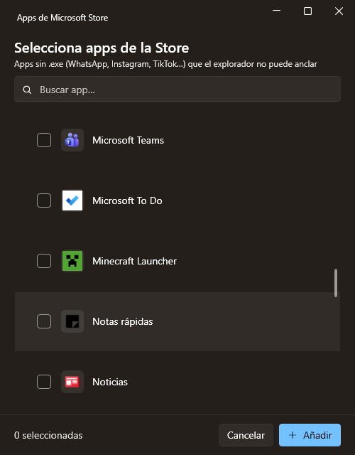

<h1 align="center">Taskbar Groups — Fluent</h1>

<p align="center">
  Group your shortcuts into a single taskbar icon. A modern <b>WPF / .NET 8</b>
  rewrite of Taskbar Groups with a Fluent (WinUI&nbsp;3-style) interface and
  built-in <b>Microsoft Store app</b> support.
</p>

<p align="center">
  
  
  
</p>

<p align="center">
  <a href="https://github.com/Mun1to/TaskbarGroupsFluent/releases/latest"><b>⬇️ Download the latest release</b></a>
</p>

<p align="center">
  
</p>

---

## ✨ Features

- **Fluent design** — Mica backdrop, rounded corners, and a light/dark theme that follows Windows.
- **Microsoft Store apps** — add UWP/MSIX apps with no `.exe` (WhatsApp, Instagram, TikTok…) from a built-in picker. These are the apps the classic file dialog can't reach.
- **Crisp 256px icons** — extracted from the Windows jumbo image list, with no shortcut-arrow overlay.
- **One-click pinning helper** — opens the shortcut folder ready to pin (Windows 11 blocks fully automatic taskbar pinning).
- **Programs, folders and Store apps** in the same group.
- **.NET 8** — the whole shell/UWP/icon interop ported off .NET Framework 4.7.2.

## ⬇️ Download & install

1. Download `TaskbarGroupsFluent-win-x64.zip` from the [latest release](https://github.com/Mun1to/TaskbarGroupsFluent/releases/latest).
2. Extract it to a **permanent location** (e.g. `C:\Apps\TaskbarGroupsFluent`). Don't run it from the zip — pinned shortcuts point at this folder.
3. Run `TaskbarGroups.App.exe`.

> **Requirement:** the [.NET 8 Desktop Runtime](https://dotnet.microsoft.com/download/dotnet/8.0) (x64). If the app doesn't start, install it and try again.

## 🚀 Usage

1. Click **Añadir grupo** and give the group a name and icon.
2. Add shortcuts with **Programa** (`.exe` / `.lnk`), **Carpeta**, or **App Store** (installed UWP apps).
3. **Guardar grupo**.
4. On the group's card, click **Anclar a la barra de tareas** and follow the 3 steps (right-click the highlighted shortcut → *Show more options* → *Pin to taskbar*).
5. Click the pinned icon to open the flyout with your apps.

## 📸 Screenshots

| Group editor | Store app picker |
| --- | --- |
|  |  |

| Taskbar flyout | |
| --- | --- |
|  | |

## 🛠️ Building from source

Requires the [.NET 8 SDK](https://dotnet.microsoft.com/download/dotnet/8.0).

```bash
git clone https://github.com/Mun1to/TaskbarGroupsFluent.git
cd TaskbarGroupsFluent
dotnet build TaskbarGroupsFluent.sln -c Release
```

Run the `TaskbarGroups.App` project. To produce a distributable build:

```bash
dotnet publish src/TaskbarGroups.App -c Release -r win-x64 --self-contained false -o dist/TaskbarGroupsFluent
dotnet publish src/TaskbarGroups.Background -c Release -r win-x64 --self-contained false -o dist/TaskbarGroupsFluent/Background
```

## 🧱 Architecture

| Project | Role |
| --- | --- |
| `TaskbarGroups.Core` | UI-agnostic logic: data model, shell/UWP/icon interop, paths |
| `TaskbarGroups.App` | Fluent editor — main window, group editor, Store app picker |
| `TaskbarGroups.Background` | Borderless flyout shown above the taskbar |

The app deploys the background flyout next to itself; a pinned shortcut launches it with the group name as its argument.

## 🙏 Credits

Built on the work of:

- [tjackenpacken/taskbar-groups](https://github.com/tjackenpacken/taskbar-groups) — the original app.
- [PikeNote/taskbar-groups-pike-beta](https://github.com/PikeNote/taskbar-groups-pike-beta) — community fork whose structure this rewrite started from.
- [WPF-UI](https://github.com/lepoco/wpfui) — the Fluent control library.

## 📜 License

[MIT](LICENSE), same as the projects above.
