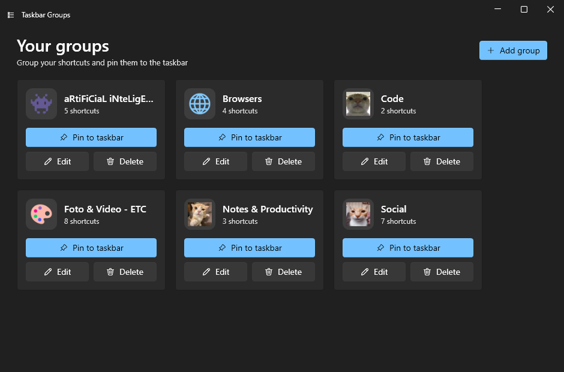
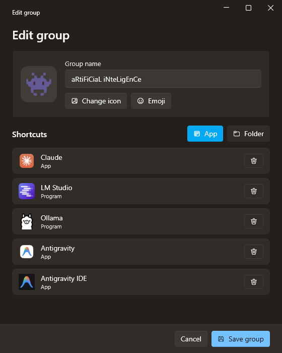
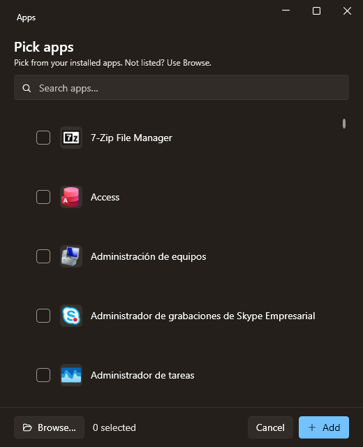
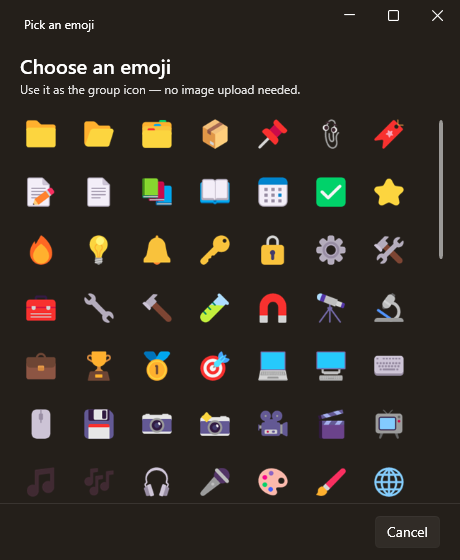

<div align="center">

# 📌 Taskbar Groups — Fluent

**Group your shortcuts into a single taskbar icon.** A modern **WPF / .NET 8** rewrite of Taskbar Groups, with a Fluent (WinUI 3-style) interface.

🌍 [Español](README.es.md) · English

<p>
  <a href="https://github.com/Mun1to/TaskbarGroupsFluent/releases/latest">
    
  </a>
  <a href="LICENSE">
    
  </a>
  
</p>

<p align="center">
  <a href="https://github.com/Mun1to/TaskbarGroupsFluent/releases/latest/download/TaskbarGroupsFluent-Setup.exe">
    
  </a>
</p>



</div>

---

## ✨ What it does

Taskbar Groups turns a folder-worth of apps into **one taskbar button**. Click it and a small flyout pops up with every app in the group — so your taskbar stays tidy and everything you need is one click away.

- 🧩 **Add any installed app** — one searchable list of *everything* installed (desktop **and** Microsoft Store apps), read straight from the Windows shell app catalog. No hunting for the right `.exe`; a **Browse…** button covers anything unlisted.
- 🖼️ **Correct icons, always** — icons come from the same shell pipeline the Start Menu uses (high-res, transparent, UWP and desktop alike). When Windows can't resolve one — some Squirrel/Electron apps like Obsidian or Brave — it falls back to the app's own executable icon, so you never get a blank placeholder.
- 🎨 **Custom group icons** — upload any image and **crop & zoom** it in the built-in editor, or…
- 😀 **…pick a colour emoji** — hit **Emoji** and choose one as the group icon, rendered crisp and centred. No image needed.
- 📌 **Pin to the taskbar** — each group becomes a pinned button; clicking it opens the flyout with your apps.
- 🔄 **Live taskbar updates** — change a pinned group's icon and the taskbar button refreshes itself, with a clean shell restart that won't disturb your other pinned icons.
- 📁 **Apps *and* folders** in the same group.
- 🌍 **Follows your Windows look** — light/dark theme **and** accent colour, plus the interface language (**English or Spanish**) are picked up from your system automatically. Override the language with the `TBG_LANG` variable.
- ⬇️ **One-click installer + automatic updates** — install with a double-click; the app checks for new versions on launch and updates itself when you say so.

---

## 📸 Screenshots

<div align="center">
  
</div>

<p align="center"><em>Your groups at a glance. Each card is a group you can pin, edit or delete; the icon can be an image or an emoji.</em></p>

| Group editor | App picker | Emoji picker |
| :--: | :--: | :--: |
|  |  |  |
| Name it, set an icon, and add apps or folders. | Every installed app, searchable, with the right icon. | Pick a colour emoji as the group icon. |

<br />

<div align="center">
  
</div>

<p align="center"><em>Click the pinned group on your taskbar and its apps appear in a flyout.</em></p>

> 💡 Images on GitHub are clickable — open any screenshot to zoom in.

---

## ⬇️ Download & install

1. Click the **Download** button above — or this direct link: **[download the installer](https://github.com/Mun1to/TaskbarGroupsFluent/releases/latest/download/TaskbarGroupsFluent-Setup.exe)**.
2. Run the downloaded `TaskbarGroupsFluent-Setup.exe`. It installs per-user (no admin needed) and, if you don't already have the **.NET 8 Desktop Runtime**, downloads and installs it for you.
3. Launch **Taskbar Groups** from the Start Menu. Done!

> Prefer to see all versions and files? They're on the [Releases page](https://github.com/Mun1to/TaskbarGroupsFluent/releases/latest).

> Windows may show an *"unknown publisher"* warning (the app isn't signed with a paid certificate yet). Click **More info → Run anyway**.

## 🔄 Automatic updates

On launch, Taskbar Groups checks GitHub for a newer version. If there is one, it offers to update — one click **downloads and installs it, then reopens the app**. No manual re-downloading.

---

## 🚀 How to use it

1. Click **Add group** and give it a **name** and an **icon** (upload & crop an image, or hit **Emoji**).
2. Add shortcuts with **App** (pick any installed app from the searchable list, or *Browse…*) or **Folder**.
3. Click **Save group**.
4. On the group's card, click **Pin to taskbar** and follow the 3 steps (right-click the highlighted shortcut → *Show more options* → *Pin to taskbar*). Windows 11 blocks fully automatic pinning, so this last step is yours to confirm.
5. Click the pinned icon to open the flyout with your apps.

> The interface is English or Spanish depending on your Windows display language. Force it with the `TBG_LANG=en` / `TBG_LANG=es` environment variable.

---

## 🛠️ Building from source

Requires the [.NET 8 SDK](https://dotnet.microsoft.com/download/dotnet/8.0).

```bash
git clone https://github.com/Mun1to/TaskbarGroupsFluent.git
cd TaskbarGroupsFluent
dotnet build TaskbarGroupsFluent.sln -c Release
```

Run the `TaskbarGroups.App` project. To produce a distributable build:

```bash
dotnet publish src/TaskbarGroups.App -c Release -r win-x64 --self-contained false -o dist/TaskbarGroupsFluent
dotnet publish src/TaskbarGroups.Background -c Release -r win-x64 --self-contained false -o dist/TaskbarGroupsFluent/Background
```

The installer is built with [Inno Setup](https://jrsoftware.org/isinfo.php) from [`installer/TaskbarGroupsFluent.iss`](installer/TaskbarGroupsFluent.iss).

### 🧱 How it works

| Project | Role |
| --- | --- |
| `TaskbarGroups.Core` | UI-agnostic logic: data model, shell `AppsFolder` catalog + icon pipeline, shell interop, paths |
| `TaskbarGroups.App` | Fluent editor — main window, group editor, app & emoji pickers, icon crop editor, updater |
| `TaskbarGroups.Background` | The borderless flyout shown above the taskbar |

The app deploys the background flyout next to itself; a pinned shortcut launches it with the group name as its argument.

## 🙏 Credits

Built on the work of:

- [tjackenpacken/taskbar-groups](https://github.com/tjackenpacken/taskbar-groups) — the original app.
- [PikeNote/taskbar-groups-pike-beta](https://github.com/PikeNote/taskbar-groups-pike-beta) — community fork whose structure this rewrite started from.
- [WPF-UI](https://github.com/lepoco/wpfui) — the Fluent control library · [SkiaSharp](https://github.com/mono/SkiaSharp) — colour-emoji rendering.

## 📜 License

[MIT](LICENSE), same as the projects above.
