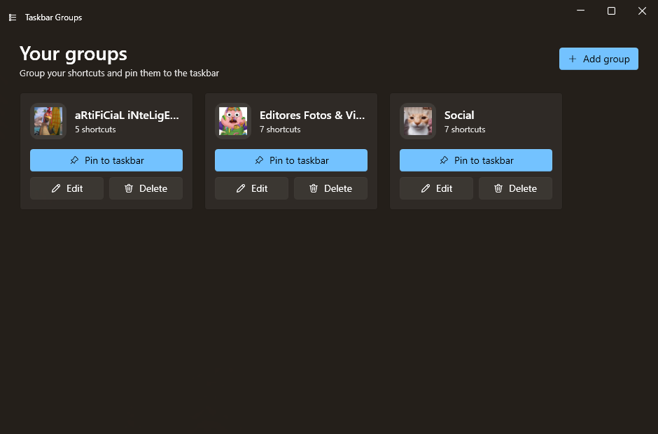
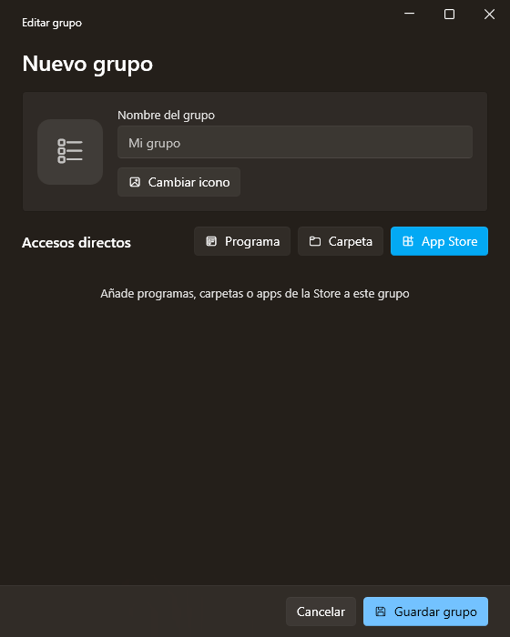
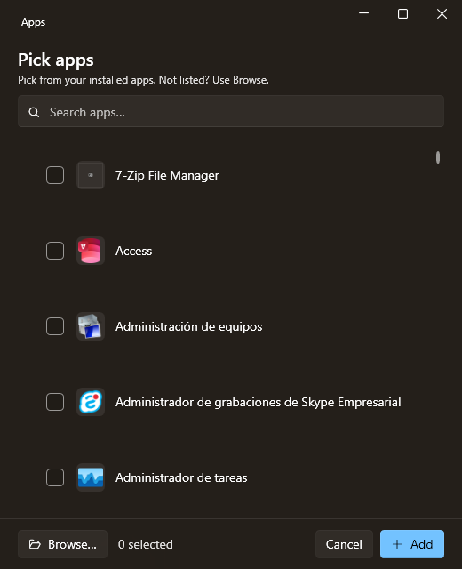
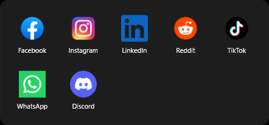

<h1 align="center">Taskbar Groups — Fluent</h1>

<p align="center">
  Group your shortcuts into a single taskbar icon. A modern <b>WPF / .NET 8</b>
  rewrite of Taskbar Groups with a Fluent (WinUI&nbsp;3-style) interface and
  built-in <b>Microsoft Store app</b> support.
</p>

<p align="center">
  
  
  
</p>

<p align="center">
  <a href="https://github.com/Mun1to/TaskbarGroupsFluent/releases/latest"><b>⬇️ Download the latest release</b></a>
</p>

<p align="center">
  
</p>

---

## ✨ Features

- **Fluent design** — Mica backdrop, rounded corners, and a light/dark theme **and accent colour that follow Windows automatically**.
- **Add any installed app** — one searchable list of everything installed (desktop **and** Microsoft Store apps), read straight from the Windows shell app catalog (`AppsFolder`). No hunting for the right `.exe`; a *Browse…* button covers anything unlisted.
- **Correct icons for every app** — icons come from the Windows shell image pipeline (the same ones the Start Menu shows), high-res and transparent, for UWP and desktop apps alike — including apps launched through a stub (e.g. Discord). When the shell can't resolve one (some Squirrel/Electron apps), it falls back to the executable's own icon, so you never get a blank placeholder.
- **Crop & zoom icons** — a built-in editor to position and crop any image before applying it as the group icon.
- **Emoji icons** — no image handy? Pick a colour emoji as the group icon (rendered crisp and centred), no upload needed.
- **Live taskbar updates** — changing a pinned group's icon refreshes the taskbar button (with a clean shell restart that won't disturb your other icons).
- **English & Spanish** — the UI follows your Windows display language (override with the `TBG_LANG` env var).
- **One-click pinning helper** — opens the shortcut folder ready to pin (Windows 11 blocks fully automatic taskbar pinning).
- **Apps and folders** in the same group.
- **.NET 8** — the whole shell/UWP/icon interop ported off .NET Framework 4.7.2.

## ⬇️ Download & install

1. Download `TaskbarGroupsFluent-win-x64.zip` from the [latest release](https://github.com/Mun1to/TaskbarGroupsFluent/releases/latest).
2. Extract it to a **permanent location** (e.g. `C:\Apps\TaskbarGroupsFluent`). Don't run it from the zip — pinned shortcuts point at this folder.
3. Run `TaskbarGroups.App.exe`.

> **Requirement:** the [.NET 8 Desktop Runtime](https://dotnet.microsoft.com/download/dotnet/8.0) (x64). If the app doesn't start, install it and try again.

## 🚀 Usage

1. Click **Add group** and give the group a name and icon (upload & crop an image, or hit **Emoji** to pick one).
2. Add shortcuts with **App** (pick any installed app — desktop or Store — from the searchable list, or *Browse…*) or **Folder**.
3. Click **Save group**.
4. On the group's card, click **Pin to taskbar** and follow the 3 steps (right-click the highlighted shortcut → *Show more options* → *Pin to taskbar*).
5. Click the pinned icon to open the flyout with your apps.

> The UI is in English or Spanish depending on your Windows display language. Force it with the `TBG_LANG=en` / `TBG_LANG=es` environment variable.

## 📸 Screenshots

| Group editor | App picker (desktop + Store) |
| --- | --- |
|  |  |

| Emoji picker | Taskbar flyout |
| --- | --- |
|  |  |

## 🛠️ Building from source

Requires the [.NET 8 SDK](https://dotnet.microsoft.com/download/dotnet/8.0).

```bash
git clone https://github.com/Mun1to/TaskbarGroupsFluent.git
cd TaskbarGroupsFluent
dotnet build TaskbarGroupsFluent.sln -c Release
```

Run the `TaskbarGroups.App` project. To produce a distributable build:

```bash
dotnet publish src/TaskbarGroups.App -c Release -r win-x64 --self-contained false -o dist/TaskbarGroupsFluent
dotnet publish src/TaskbarGroups.Background -c Release -r win-x64 --self-contained false -o dist/TaskbarGroupsFluent/Background
```

## 🧱 Architecture

| Project | Role |
| --- | --- |
| `TaskbarGroups.Core` | UI-agnostic logic: data model, shell AppsFolder catalog + icon pipeline, shell interop, paths |
| `TaskbarGroups.App` | Fluent editor — main window, group editor, app picker, icon crop editor, localization |
| `TaskbarGroups.Background` | Borderless flyout shown above the taskbar |

The app deploys the background flyout next to itself; a pinned shortcut launches it with the group name as its argument.

## 🙏 Credits

Built on the work of:

- [tjackenpacken/taskbar-groups](https://github.com/tjackenpacken/taskbar-groups) — the original app.
- [PikeNote/taskbar-groups-pike-beta](https://github.com/PikeNote/taskbar-groups-pike-beta) — community fork whose structure this rewrite started from.
- [WPF-UI](https://github.com/lepoco/wpfui) — the Fluent control library.

## 📜 License

[MIT](LICENSE), same as the projects above.
